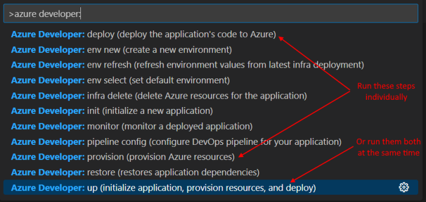

# AZD Command Line Deploy

The Azure Developer CLI (azd) is an open-source tool that accelerates the time it takes to get started on Azure. azd provides a set of developer-friendly commands that map to key stages in a workflow (code, build, deploy, monitor).

This project has been configured to work with AZD commands to make it fast and easy to deploy a demo.

---

## Configuration Secrets

This application requires a few secrets to be configured in the application which allow for authentication and access to the ChatGPT API.  To configure these secrets, create a file named `infra\azdKeys.json` (copy and rename the template file `\azdKeys.json.txt`), and update these secret values:

```bash
{
    "openAIResourceName": "yourOpenAIAzureResource",
    "openAIApiKey": "yourOpenAIApiKey",
    "adDomain": "yourDomain.onmicrosoft.com",
    "adTenantId": "yourTenantId",
    "adClientId": "yourClientId"
}
```

The OpenAI keys are required come from the resource that you created in the Azure portal for accessing the OpenAI API.

The Domain, TenantId and ClientId are optional and only expected if you want to enable authentication.  The values come from an Azure Active Directory App Registration that is used to authorized this application.  Go to the App Registration -> Authentication Page, and enter a new Redirect URI for this application.  The Redirect URI should be something like `https://xxx-chatgpt.azurewebsites.net/signin-oidc` and `https://localhost:7078/signin-oidc`.

---

## Environment Names

When an AZD command is run for the first time, a prompt will ask for the "Environment Name", the Azure Subscription to use and the Azure Region to deploy to.

*NOTE: this Environment Name is NOT an environment code like [dev/qa/prod]!*

Choose the "Environment Name" carefully, as it will be used as the basis to name all of the resources, so it must be unique. Use a naming convention like *[yourInitials]-[appName]* or *[yourOrganization]-[appName]* as the format for Environment Name. The resulting web application name `MUST` be globally unique.

For example, if Environment Name is equal to: 'xxx-chatgpt', AZD will create a Azure resources with these names:

| Azure Resource | Name                       | Uniqueness        |
| -------------- | -------------------------- | ----------------- |
| Resource Group |  rg-xxx-chatgpt            | in a subscription |
| Azure Website  |  xxx-chatgpt-azd           | global            |

Storage accounts and other resources will be named in a similarly fashion.

---

## Commands

The four commands of most interest are:

- **azd up**: provisions Azure resources, builds app, and deploys it to Azure
- **azd provision**: provisions Azure resources but does not build and deploy the application
- **azd deploy**: builds the app and deploys it to existing Azure resources
- **azd down**: removes Azure resources create by this AZD command

Typically a developer with either do the up command to do everything at once, or do the provision and deploy commands separately.

---

## Visual Studio Code

There is a Azure Developer CLI [extension](https://marketplace.visualstudio.com/items?itemName=ms-azuretools.azure-dev) available in Visual Studio Code. If that is installed, it is easy to pop up the command window like this:



---

## Command Line

These commands can also be run on the command line, like this:

```bash
> azd up
```

## Example Command Execution


### Resources Created


---

## Reference

[Azure Developer CLI Reference](https://learn.microsoft.com/en-us/azure/developer/azure-developer-cli/)

[Introducing the Azure Developer CLI - Azure SDK Blog](https://devblogs.microsoft.com/azure-sdk/introducing-the-azure-developer-cli-a-faster-way-to-build-apps-for-the-cloud/)

[Make your project compatible with Azure Developer CLI](https://learn.microsoft.com/en-us/azure/developer/azure-developer-cli/make-azd-compatible?pivots=azd-create)
